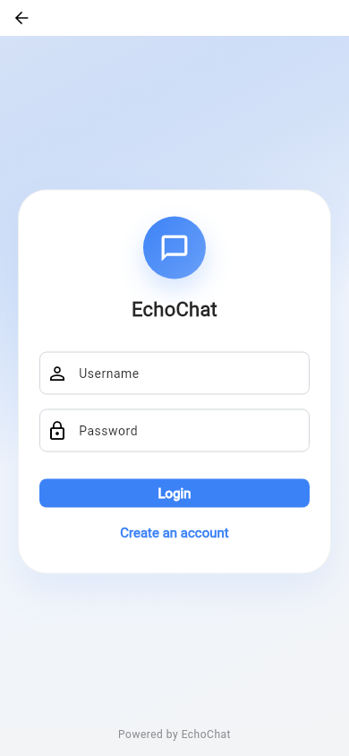
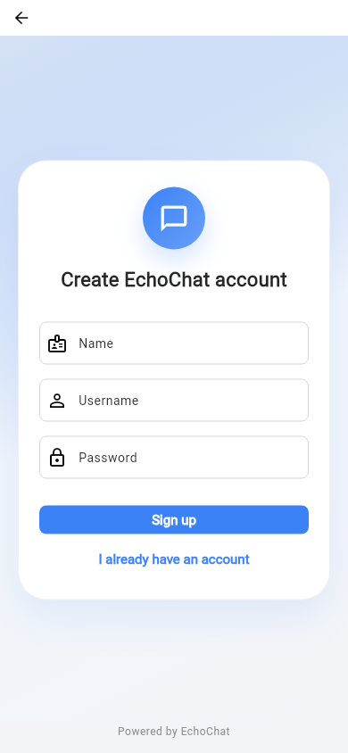
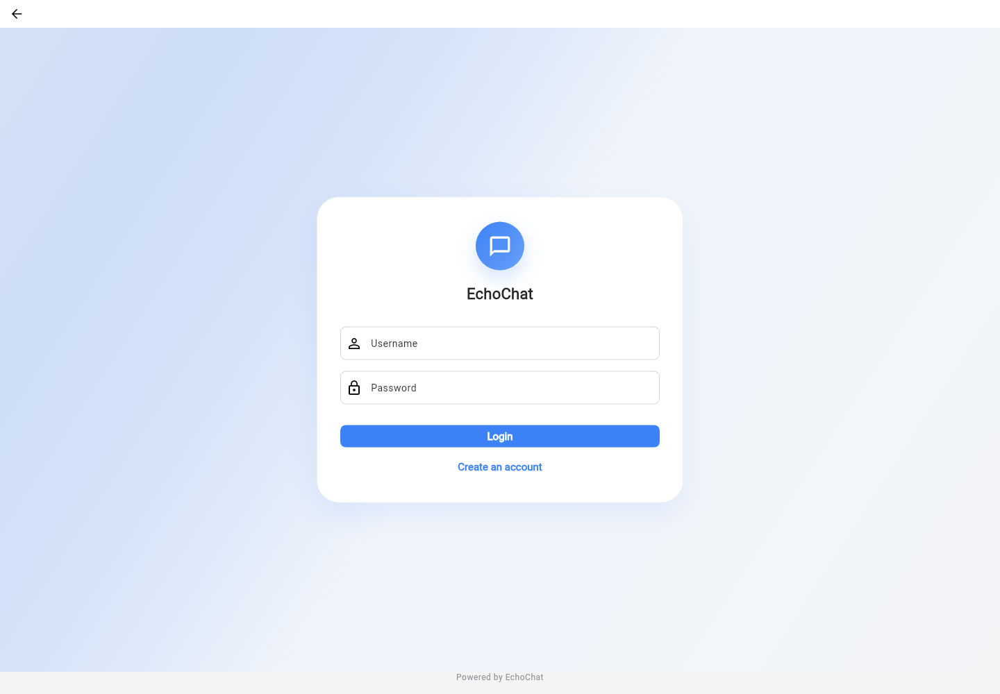
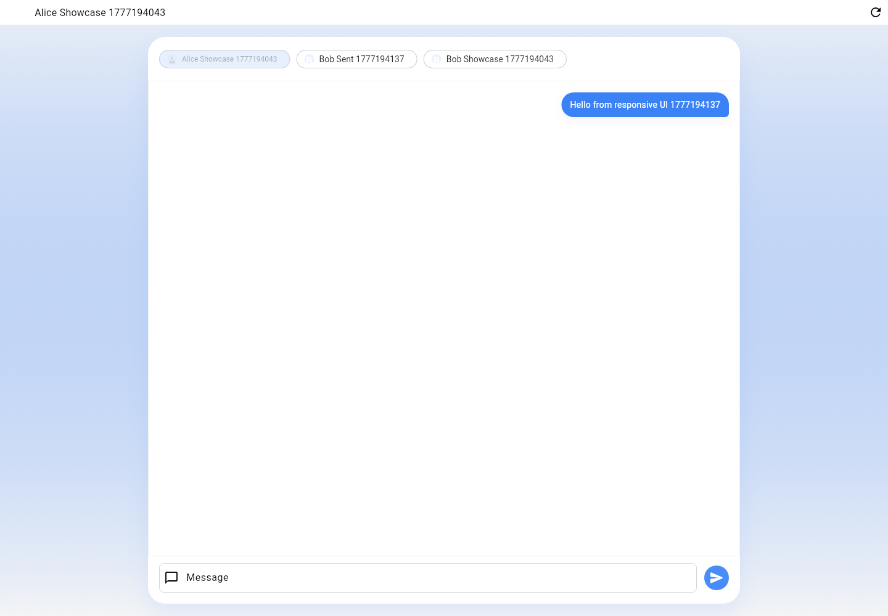
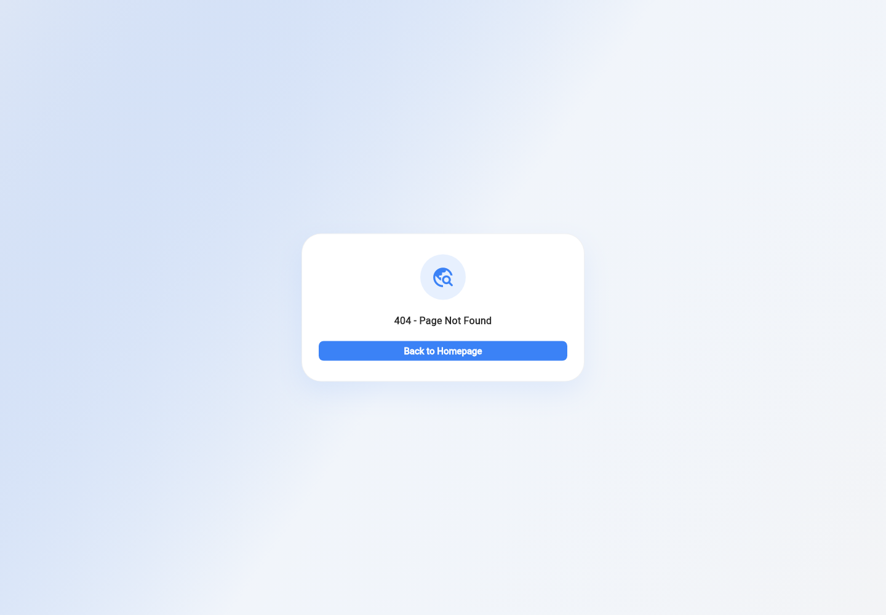

# EchoChat

EchoChat is a demo Flutter chat app built around **local-first messaging**. The chat UI reads SQLite first, renders cached data immediately, then syncs with the Dart Frog backend in the background. Sending also starts locally: messages are inserted as `pending` before the network request and later become `sent` or `failed`.

## Responsive UI showcase

<p>
  
  
</p>

<p>
  
  
</p>

<p>
  
</p>

## Local-first workflow

```text
Open chat screen
  |
  |-- read local cache ---------------------> SQLite
  |      |                                      |
  |      |                                      |-- chatPeer
  |      |                                      `-- chatMessage
  |      |
  |      `-- render cached peers/messages immediately
  |
  `-- sync remote in background ------------> Dart Frog API
         |                                      |
         |                                      |-- GET /api/chat/users
         |                                      `-- GET /api/chat/messages?peer_user_id=<id>
         |
         `-- upsert server data ------------> SQLite
                |
                `-- re-read local rows -----> render refreshed UI

Rule: the final UI state always comes from SQLite, never directly from a server DTO.
```

## Send and retry workflow

```text
User sends message
  |
  |-- generate client_message_id
  |
  |-- insert local chatMessage as pending ---> SQLite
  |      |
  |      `-- render pending bubble immediately
  |
  `-- POST /api/chat/messages --------------> Dart Frog API
         |
         |-- success ------------------------> mark local row sent
         |                                      |-- remote_id
         |                                      `-- server created_at
         |
         `-- failure ------------------------> mark local row failed
                                                `-- keep client_message_id

User taps failed bubble
  |
  |-- mark same local row pending ----------> SQLite
  |
  `-- POST same client_message_id ----------> Dart Frog API
         |
         `-- backend returns existing message if that id was already saved
```

The stable `client_message_id` is the retry/idempotency key. Reusing it for the same sender prevents duplicate remote messages.

## Sync conflict and scale plan

Current sync is intentionally simple:

- Messages are immutable, so there is no edit/delete merge policy yet.
- The server-confirmed row wins when it has the same `client_message_id` or `remote_id`.
- SQLite reads only the latest local conversation window for the UI.
- Remote refresh currently syncs the conversation response the backend returns, then re-reads SQLite.

Next production-oriented steps:

1. Add per-conversation sync metadata with newest and oldest remote cursors.
2. Change refresh to delta sync: fetch only messages newer than the newest local cursor.
3. Add history pagination: fetch older pages only when the user scrolls upward.
4. Batch remote upserts in SQLite transactions to avoid one write round-trip per message.
5. Add `updated_at`, `deleted_at`, and version fields before supporting edits or deletes.
6. Add cache retention rules so very large conversations do not grow forever on-device.

With this plan, normal refresh stays small, old history loads on demand, and conflict rules remain explicit as chat features grow.

## Layer responsibilities

```text
Presentation
  ChatScreen -> user input and message bubbles
  ChatBloc   -> cache-first screen state and per-message status

Domain
  ChatUsecase -> cache reads, remote sync, outbox drain, send, retry

Data
  ChatLocalRepository      -> DAO orchestration
  ChatPeerDao              -> cached peers
  ChatMessageDao           -> cached messages + outbox state
  AppApiService            -> REST calls

Backend
  Dart Frog routes -> auth/input validation
  ChatService      -> chat rules and idempotency
  DemoStore        -> in-memory demo users/messages
```

## Local data model

SQLite chat tables live in the Flutter app:

- `chatPeer` caches messageable users.
- `chatMessage` stores cached, `pending`, `sent`, and `failed` direct messages.

Important `chatMessage` fields:

- `local_id` — local ordering.
- `remote_id` — server-confirmed id.
- `client_message_id` — local idempotency and backend retry deduplication.
- `conversation_peer_user_id` — conversation query key.
- `sender_user_id`, `recipient_user_id`, `message`, `created_at`, `status`, `error_message`.

Indexes enforce unique local `client_message_id`, unique non-null `remote_id`, and efficient conversation ordering.

## Monorepo layout

```text
├── apps/main/              Flutter client
│   ├── lib/data/           SQLite DAOs and local repositories
│   ├── lib/domain/         chat/auth use cases and entities
│   └── lib/presentation/   BLoC screens and widgets
├── apps/backend/           Dart Frog demo backend
├── core/                   shared Flutter/client infrastructure
├── modules/data_source/    shared client DTOs and API models
├── plugins/                reusable Flutter packages from the template
├── docs/                   architecture, API, and roadmap notes
└── makefile                project commands
```

## Backend API

Chat endpoints require `Authorization: Bearer <token>`:

- `GET /api/chat/users` — list peers excluding the current user.
- `GET /api/chat/messages?peer_user_id=<id>` — fetch a direct conversation.
- `POST /api/chat/messages` — send a direct message with `recipient_user_id`, `client_message_id`, and `message`.

See `docs/backend-api.md` for request/response examples.

## Web SQLite

Flutter web uses `sqflite_common_ffi_web`. The required static assets are checked into `apps/main/web/`:

- `sqflite_sw.js`
- `sqlite3.wasm`

If the package or wasm binary changes, refresh them from `apps/main`:

```bash
fvm dart run sqflite_common_ffi_web:setup --force
```

## Run locally

```bash
cp apps/main/.env.example apps/main/.env
cp apps/backend/.env.example apps/backend/.env
make pub_get
make gen_all
```

Start the backend:

```bash
make run_backend_e2e
```

Run the Flutter web app:

```bash
cd apps/main
fvm flutter run -d web-server \
  --web-hostname 127.0.0.1 \
  --web-port 8092 \
  --dart-define-from-file=.env \
  -t lib/main_dev.dart
```

## Verification

```bash
fvm flutter analyze
cd apps/main && fvm flutter test
```

Manual regression path:

1. Start the backend and Flutter web app.
2. Sign up two users.
3. Sign in as one user and select the other as a peer.
4. Send a message and verify it appears immediately, then becomes sent.
5. Simulate a failed `POST /api/chat/messages` and verify `Failed. Tap to retry`.
6. Restore the backend and tap the failed bubble; verify retry clears the failed state without duplicating the remote message.
7. Reload with remote conversation sync delayed; verify cached peers/messages render before the remote response.

## More documentation

- `docs/architecture.md` — full client/backend data flow.
- `docs/backend-api.md` — API contract details.
- `docs/todos.md` — roadmap and completed phases.
